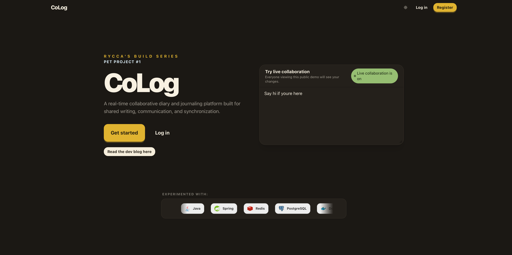
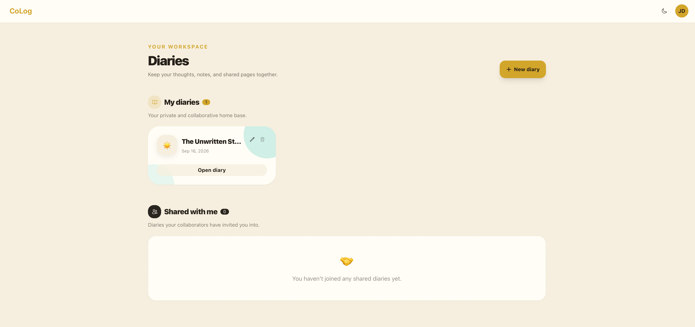
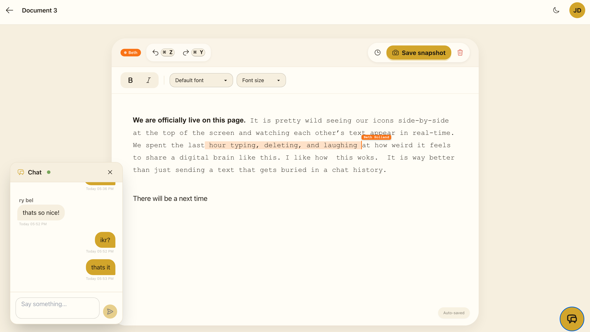
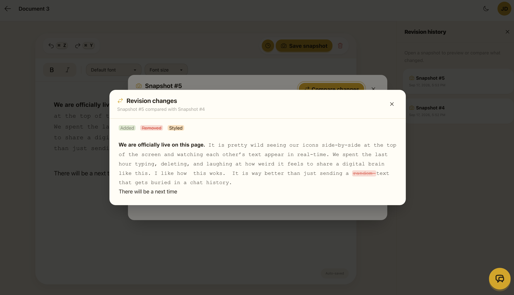

# CoLog — Frontend

CoLog is a real-time collaborative diary and journaling application. This repository contains its responsive web client: a space where users can create diaries, invite collaborators, co-write rich-text entries, chat in context, and revisit earlier revisions.

The CoLog backend is maintained in a separate repository:

CoLog Backend:
https://github.com/Zimgo012/CoLog-Backend

## Highlights

- Secure registration and sign-in with JWT-backed protected routes
- Personal and shared diary management, including collaborator controls
- Rich-text document editor with formatting, undo/redo, live cursors, and collaborator presence
- Real-time document synchronization and per-diary chat
- Document snapshots, revision history, and side-by-side diff viewing
- In-app notifications, profile editing, confirmations, and light/dark themes

## Screenshots

### Landing page



### Diary library



### Collaborative editor



### Revision comparison



## Technology stack

### Frontend

- **React 18** and **TypeScript** for the application UI
- **Vite** for development and production builds
- **React Router** for client-side routing and protected pages
- **Tailwind CSS**, **daisyUI**, and **Heroicons** for styling and interface components
- **ProseMirror** for the rich-text editing experience
- **Yjs**, **y-prosemirror**, and **y-protocols** for collaborative editing and awareness state
- **STOMP.js** over **WebSocket** for real-time collaboration, chat, and notifications

### Connected platform services

The frontend is designed to connect to the broader CoLog platform, which uses **Java**, **Spring**, **PostgreSQL**, **Redis**, **Docker**, **GitHub Actions**, **Render**, **Aiven**, **Cloudflare**, and **Upstash**.

## Project structure

```text
src/
├── api/          # REST and WebSocket client modules
├── auth/         # Authentication state and route protection
├── components/   # Reusable UI and collaboration components
├── context/      # Theme, notification, and diary-session state
├── lib/          # Editor schema, presence, and Yjs provider utilities
└── pages/        # Route-level application views
```
